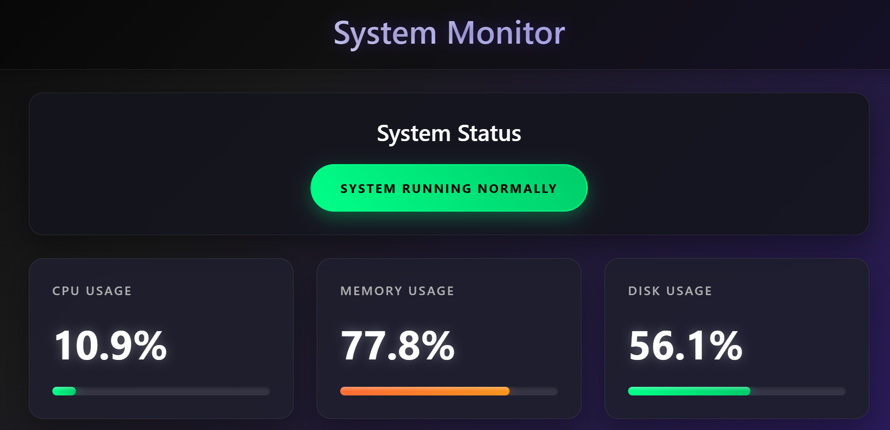

# 🌩️ Cloud Monitoring App (Flask + AWS EKS)

A lightweight cloud infrastructure monitoring app built with **Flask**, containerized with **Docker**, and deployed on **Amazon EKS (Elastic Kubernetes Service)**. It provides real-time system metrics such as CPU, memory, and disk usage via a REST API and web dashboard.

---



## 🔧 Features

- 🔍 Real-time monitoring of CPU, memory, and disk usage  
- 🚨 CPU usage alert based on configurable threshold  
- 📦 Dockerized Flask application  
- ☸️ Deployed on Kubernetes via Amazon EKS  
- 📡 REST API endpoints for accessing system metrics  

---

## 📁 Project Structure

```

cloud-monitoring-app/
├── app.py               # Flask application
├── templates/
│   └── index.html       # Dashboard UI
├── Dockerfile           # Docker container build file
├── requirements.txt     # Python dependencies
├── deployment.yaml      # Kubernetes Deployment manifest
├── service.yaml         # Kubernetes Service manifest
└── README.md            # This file

````

---

## 🚀 Running the App

### Locally with Docker:

```bash
docker build -t cloud-monitoring-app .
docker run -p 5000:5000 cloud-monitoring-app
````

Access via: `http://localhost:5000`

---

### On Kubernetes (Amazon EKS):

1. Deploy manifests:

```bash
kubectl apply -f deployment.yaml
kubectl apply -f service.yaml
```

2. Check status:

```bash
kubectl get pods
kubectl get svc
```

3. Access locally via port forwarding:

```bash
kubectl port-forward pod/<pod-name> 5000:5000
```

4. (Optional) Expose service publicly via LoadBalancer:

```bash
kubectl patch svc my-flask-service -p '{"spec": {"type": "LoadBalancer"}}'
```

Access via the assigned external IP at port 5000.

---

## 🧪 API Endpoints

* `/` — Web dashboard (HTML)
* `/api/status` — Real-time CPU, memory, and disk usage metrics
* `/api/cpu` — CPU usage only

---

## 🧰 Requirements

* Python 3.8+
* Flask
* psutil
* Docker
* AWS CLI and `kubectl` configured with EKS access

---

## ⚠️ Notes

* The app uses Flask’s development server; for production, use a production-grade WSGI server (e.g., Gunicorn).
* This project serves as a learning and demo tool for cloud-native monitoring and Kubernetes deployment.

---

## 📄 License

© Younus Mashoor